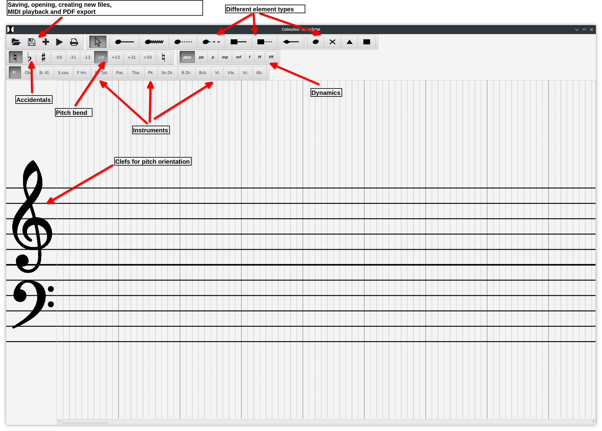

# CoGnoSco

**CoGnoSco** is a user interface to **Co**nvert **G**raphic **n**otations to **o**rdinary **Sco**res.

## What it does

When you start CoGnoSco it will show a new graphic score.  

Creating and editing scores should be almost self-explanatory.  

### Global keyboard shortcuts

These shortcuts trigger global actions independent of the currently selected element.

| Shortcut | Action |
| --- | --- |
| `T` | Focus element-type bar |
| `D` | Focus dynamics bar |  
| `B` | Focus pitch bend bar |
| `+` | Select next-louder dynamic |
| `-` | Select next-quieter dynamic |
| `N` | Select natural-sign | 
| `F` | Select flat-sign |
| `S` | Select sharp-sign |  
| `Ctrl+O` | Open file |
| `Ctrl+S` | Save file |
| `Ctrl+N` | Create new file | 
| `SPACE` | Play/Pause/Resume |
| `Ctrl+P` | Create PDF Score |

### Contextual keyboard shortcuts

These shortcuts trigger actions local to the currently selected element.

| Shortcut | Action |
| --- | --- |
| `Esc` | Abort element creation and go into select mode
| `Delete` |  Delete element |
| `Ctrl+⬇` | Move selected note head down |
| `Ctrl+⬆` | Move selected note head up |
| `Ctrl+⬅`️ | Move selected element left |
| `Ctrl+➡️️` | Move selected element right |

### Navigating in the parameter-bars

To avoid using the mouse, you can navigate the parameter-bars (e.g. for accidentals, dynamics, etc.) with the arrow keys, 
Also, you can select elements of the parameter-bars 
by pressing their corresponding (zero-based) index in the focused parameter-bar.
For example, to select the instrument *Oboe*, 
type `I` to focus the instrument parameter-bar 
and then `1` to select the second instrument.

### Creating simple elements

The simple elements are the ones that don't have a line attached to them.
To create a simple element, 
simply select the intended element-type, accidental, dynamic and instrument in the parameter-bars
and then click into the stave-area, to select the position and pitch of the element.

### Creating crescendo-decrescendo elements

Select one of the element-types that do have a line attached to the shapes, 
choose the additional parameters,
and click into the stave-area, to select the pitch and the start of the crescendo.
Next, choose the climax by clicking into the stave-area a second time, while having the climax-dynamic selected.
Lastly, choose the end of the decrescendo by clicking into stave-area a third time, while having the end-dynamic selected.

### Creating trills

To create a trill, select the trill element-type (it's the second element of the element-type parameter-bar), 
for example by typing `T` and then `2`.
Then choose the position and pitch of the trill start.
When you have chosen a pitch by left-clicking, a second tinier note appears, 
which represents the secondary pitch of the trill.
By pressing `Enter` you confirm the secondary pitch.
The rest is similar to [creating crescendo-decrescendo elements](#creating-crescendo-decrescendo-elements)

### Opening and saving files

Graphic scores are stored in JSON format.
To create, open, and save files, use the corresponding action buttons 
or the keyboard shortcuts mentioned in [Global shortcuts](#global-keyboard-shortcuts).

### Exporting ordinary scores

Graphic scores created with CoGnoSco can be converted to ordinary scores in the PDF format.
(In fact, this is the whole point of the project.) 
CoGnoSco uses [LilyPond](https://lilypond.org) to typeset scores,
so the `lilypond`-command should be on your path if you want to export scores.

### MIDI playback

CoGnoSco supports rudimentary MIDI playback.
The `▶`-Button is used to play, pause and resume playback.

### Command line interface

If you just want to typeset scores stored as JSON files, you don't have to do this via the user-interface.
Instead, you can use the small Command line interface provided by CoGnoSco. The supported commands are:

| Command | Action |
| ---  | --- |
| `launch <file>` | Launches CoGnoSco opening the specified `file` |
| `typeset <file>`  | Creates a ordinary score from the graphic score contained in the specified `file` |
| `play <file>` | Plays the specified graphic score using MIDI |
| `help` | Prints a help page |

## How to get it running

Being built on top of the JavaFX Framework, CoGnoSco should run on pretty much any OS. Just clone the project locally  
``git clone https://github.com/NKb03/CoGnoSco.git``  
and then build and run it using Gradle  
``./gradlew run``.  
To export graphic scores as ordinary PDF scores you need [LilyPond](https://lilypond.org/) on your path.

## Author

Nikolaus Knop ([niko.knop003@gmail.com](mailto:niko.knop003@gmail.com))

## License

This project is licensed under the GNU General Public License - see the [LICENSE](LICENSE) file for details.
